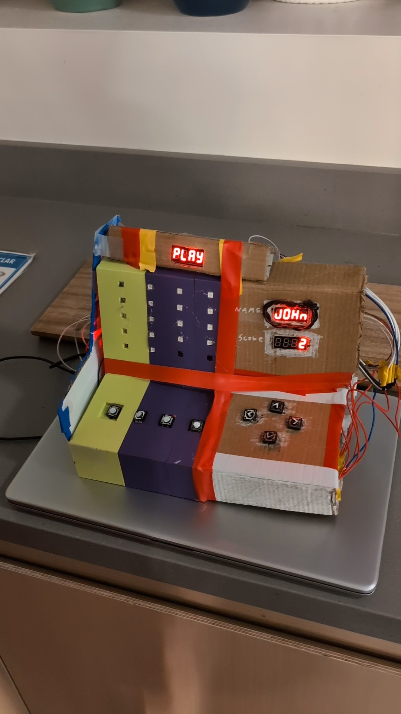
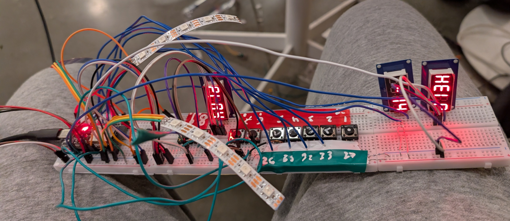

# Rhythm Arcade game

This is a Rhythm arcade machine. You can play a cool rythm game with it, and get FREE TICTACs!

It uses an esp32, 7-segment display, a few buttons and neopixels (WS2812B).

## Why we made it?

We made this project for Undercity, a hardware hackathon in SF, CA. The goal was to make a fun game that people could play and to have a fun time making it.

## Problems with the design and construction
- LONG printing queue for the 3d printers
- Failed 3d print of the case, we were unable to reprint it in time
- the wires breaking and disconnecting
- the buttons not working properly
- the neopixels not lighting up properly
- the code not working properly

## Media

[Video](https://youtube.com/shorts/bDOee6ckOYs)

  
electronics

  

## BOM

| Component          | Quantity |
| ------------------ | -------- |
| ESP32-devboard     | 1        |
| 7-segment display  | 3        |
| WS2812B led strips | 4        |
| 3D printed case    | 1        |
| Buttons            | 8        |
| Jumper wires       | LOTS     |
| electrical tape    | LOTS     |
| cardboard          | a sheet  |
| 25cm 2020 V-Slot   | 2        |
